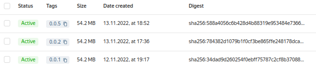

## Дипломный проект

--- 
### Этапы выполнения:  
1. Подготовка облачной инфраструктуры на базе облачного 
провайдера Yandex.Cloud;  
2. Запуск и конфигурация Kubernetes кластера;  
3. Создание тестового приложения;
4. Подготовка системы мониторинга и деплой приложения;
5. Установка и настройка CI/CD.

---

#### 1. Подготовка облачной инфраструктуры на базе облачного провайдера Yandex.Cloud:  
Для создания облачной инфрастуктуры будем использовать
`Terraform`, создаем и храним бэк в S3 хранилище в ЯО.  
Конф будет создан на два workspace, но использовать будем один - `stage`.  
Далее, у нас уже инициировано облако в ЯО еще при выполнении 
домашних заданий, но пойдем по новой, и создадим необходимую 
учетную запись и добавим ей необходимые права:  
 - создадим **service account** для учетки `terraform` с ролью **editor** 
и **container-registry.admin** (для создания, изменения 
и удаления реестра), и так-же добавим роль **storage.editor**, для 
таких же манипуляций с хранилищем S3;  
```commandline
[jekis_@fedora terraform]$ yc iam service-account create terraform
id: ajelm6hd4f7t38q6dfki
folder_id: b1gns3a84pvt7rd1h1vn
created_at: "2022-11-06T11:27:13.595546885Z"
name: terraform
[jekis_@fedora terraform]$ yc resource-manager folder add-access-binding netology --role editor --subject serviceAccount:ajelm6hd4f7t38q6dfki
done (2s)
[jekis_@fedora terraform]$ yc resource-manager folder add-access-binding netology --role container-registry.admin --subject serviceAccount:ajelm6hd4f7t38q6dfki
[jekis_@fedora terraform]$ yc resource-manager folder add-access-binding netology --role storage.editor --subject serviceAccount:ajelm6hd4f7t38q6dfki
done (1s)
[jekis_@fedora terraform]$ yc resource-manager folder list-access-bindings netology
+--------------------------+----------------+----------------------+
|         ROLE ID          |  SUBJECT TYPE  |      SUBJECT ID      |
+--------------------------+----------------+----------------------+
| container-registry.admin | serviceAccount | ajelm6hd4f7t38q6dfki |
| editor                   | serviceAccount | ajelm6hd4f7t38q6dfki |
| storage.editor           | serviceAccount | ajelm6hd4f7t38q6dfki |
+--------------------------+----------------+----------------------+
```
Добавляем к **service account** ключ и записываем его 
в отдельный файл `key.json`:  
```commandline
[jekis_@fedora terraform]$ yc iam key create --service-account-id=ajelm6hd4f7t38q6dfki --output key.json
id: ajec3h41dnfl65napfva
service_account_id: ajelm6hd4f7t38q6dfki
created_at: "2022-11-06T11:33:05.471013739Z"
key_algorithm: RSA_2048

[jekis_@fedora terraform]$ ll
итого 4
-rw-------. 1 jekis_ jekis_ 2402 ноя  6 14:33 key.json
```
Далее воспользуемся альтернативным вариантом хранения 
состояния `Terraform`, а именно будем сохранять конфигурацию
 в Object Storage, для этого создадим дополнительный конфиг,
 где опишем настройки подключения к S3 хранилищу в 
файле [provider.tf](./terraform/provider.tf):  
```terraform
backend "s3" {
    endpoint   = "storage.yandexcloud.net"
    bucket     = "netol0gy-tfstate"
    region     = "ru-central1-a"
    key        = "terraform.tfstate"
    access_key = ""
    secret_key = ""

    skip_region_validation      = true
    skip_credentials_validation = true

    workspaces {
      prefix = "space-"
    }
  }
```
Далее создадим файл описания инстансов для кубера 
[k8s.tf](./terraform/k8s.tf), в **stage** окружении мы создадим 1 control 
ноду и 2 worker ноды, в **prod** у нас будет 3 control 
ноды и 3 worker ноды.   
Затем сделаем `Container Registry` и дополнительные 
**service account**:  
Создадим сам `Container Registry` с именем **image-registry**:  
```terraform
resource "yandex_container_registry" "image-registry" {
  name      = "image-registry"
  folder_id = "b1gns3a84pvt7rd1h1vn"
  labels = {
    my-label = "registry"
  }
}
```
Далее создадим два **service account**:  
* Для pull образов (k8s-sa) и дальнейшего развертывания 
в кластере kubernetes:
```terraform
resource "yandex_iam_service_account" "k8s-sa" {
  name = "k8s-service-account"
}

resource "yandex_iam_service_account_key" "k8s-sa-key" {
  service_account_id = yandex_iam_service_account.k8s-sa.id
  description        = "k8s-service-account-key"
  depends_on = [
    yandex_iam_service_account.k8s-sa
  ]
}

resource "yandex_container_registry_iam_binding" "k8s-role-puller" {
  registry_id = yandex_container_registry.image-registry.id
  role        = "container-registry.images.puller"
  members = [
    "serviceAccount:${yandex_iam_service_account.k8s-sa.id}"
  ]
  depends_on = [
    yandex_container_registry.image-registry,
    yandex_iam_service_account.k8s-sa,
  ]
}
```
* Для push образов (ci-cd) и дальнейшего использования 
при работе с CI/CD:  
```terraform
resource "yandex_iam_service_account" "ci-cd" {
  name = "ci-cd-service-account"
}

# Созадим ключ для доступа к аккаунту ci-cd
resource "yandex_iam_service_account_key" "ci-cd-key" {
  service_account_id = yandex_iam_service_account.ci-cd.id
  description        = "ci-cd-service-account-key"
  depends_on = [
    yandex_iam_service_account.ci-cd
  ]
}

# Привяжем сервисный аккаунт для ci-cd к роли для push образов
resource "yandex_container_registry_iam_binding" "ci-cd-role-pusher" {
  registry_id = yandex_container_registry.image-registry.id
  role        = "container-registry.images.pusher"
  members     = ["serviceAccount:${yandex_iam_service_account.ci-cd.id}"]
  depends_on = [
    yandex_container_registry.image-registry,
    yandex_iam_service_account.ci-cd,
  ]
}
```
Полный манифест создания registry - [registry.tf](./terraform/registry.tf).  

Для того, чтобы видеть какие IP-адреса будут получены 
после создания ВМ, мы опишем это в файле 
[outputs.tf](./terraform/outputs.tf). А также добавим 
дополнительную необходимую нам информацию после 
развертывания.
В итоге, после развертывания кластера с помощью 
`Terraform` мы получим следующую информацию:  
* О внешних IP-адресах нод;
* О внутренних IP-адресах нод;
* Адрес созданного репозитория в YC;
* Информацию о ключе созданного ранее service account k8s;
* Информацию о ключе созданного ранее service account ci-cd.

Далее создадим два `workspace`, **space-prod** и **space-stage** в 
`terraform` и выберем **space-stage** для дальнейшей работы:  
```commandline
[jekis_@fedora terraform]$ terraform workspace new space-stage
Created and switched to workspace "space-stage"!

You're now on a new, empty workspace. Workspaces isolate their state,
so if you run "terraform plan" Terraform will not see any existing state
for this configuration.
[jekis_@fedora terraform]$ terraform workspace new space-prod
Created and switched to workspace "space-prod"!

You're now on a new, empty workspace. Workspaces isolate their state,
so if you run "terraform plan" Terraform will not see any existing state
for this configuration.
[jekis_@fedora terraform]$ terraform workspace select space-stage
Switched to workspace "space-stage".
[jekis_@fedora terraform]$ terraform workspace list
  default
  space-prod
* space-stage
```
Выполним проверку наших конфигов и посмотрим план и применим его:  
```commandline
[jekis_@fedora terraform]$ terraform validate
Success! The configuration is valid.
[jekis_@fedora terraform]$ terraform plan
...
[jekis_@fedora terraform]$ terraform applay
...
...
Apply complete! Resources: 14 added, 0 changed, 0 destroyed.

Outputs:

ci-cd-key = <sensitive>
container_registry = "cr.yandex/crpj1jsq365to4tnd8v3"
k8s-sa-key = <sensitive>
kube_control_plane = [
  "51.250.11.42",
]
kube_control_plane_IP = [
  "10.128.0.33",
]
kube_node = [
  "51.250.71.251",
  "158.160.15.47",
]
kube_node_IP = [
  "10.128.0.14",
  "10.129.0.26",
]
```
Так же проверим созданные инстансы в вэбе ЯО:  


Созданные ВМ:  
    

После создания новых `service account`, необходимо получить значения 
их ключей в json формате и сохранить:  
```commandline
terraform output -json k8s-sa-key > key_k8s.json
terraform output -json ci-cd-key > key_ci_cd.json
```
Они нужны нам будут далее.

---

#### 2. Запуск и конфигурация Kubernetes кластера.  
Сам кубер будем разворачивать посредством **kuberspray**  
https://github.com/kubernetes-sigs/kubespray  
Клонируем репозиторий:  
```commandline
ubuntu@kube-control-plane-0:~$ git clone https://github.com/kubernetes-sigs/kubespray.git
Cloning into 'kubespray'...
remote: Enumerating objects: 64918, done.
remote: Counting objects: 100% (77/77), done.
remote: Compressing objects: 100% (66/66), done.
remote: Total 64918 (delta 26), reused 50 (delta 9), pack-reused 64841
Receiving objects: 100% (64918/64918), 20.41 MiB | 23.07 MiB/s, done.
Resolving deltas: 100% (36483/36483), done.
```
Установим зависимости:  
<details>
<summary> sudo pip3 install -r requirements.txt </summary>

```commandline
Collecting ansible==5.7.1
  Downloading ansible-5.7.1.tar.gz (35.7 MB)
     |████████████████████████████████| 35.7 MB 39 kB/s 
Collecting ansible-core==2.12.5
  Downloading ansible-core-2.12.5.tar.gz (7.8 MB)
     |████████████████████████████████| 7.8 MB 48.5 MB/s 
Collecting cryptography==3.4.8
  Downloading cryptography-3.4.8-cp36-abi3-manylinux_2_17_x86_64.manylinux2014_x86_64.whl (3.2 MB)
     |████████████████████████████████| 3.2 MB 100.4 MB/s 
Collecting jinja2==2.11.3
  Downloading Jinja2-2.11.3-py2.py3-none-any.whl (125 kB)
     |████████████████████████████████| 125 kB 64.3 MB/s 
Collecting netaddr==0.7.19
  Downloading netaddr-0.7.19-py2.py3-none-any.whl (1.6 MB)
     |████████████████████████████████| 1.6 MB 97.8 MB/s 
Collecting pbr==5.4.4
  Downloading pbr-5.4.4-py2.py3-none-any.whl (110 kB)
     |████████████████████████████████| 110 kB 89.0 MB/s 
Collecting jmespath==0.9.5
  Downloading jmespath-0.9.5-py2.py3-none-any.whl (24 kB)
Collecting ruamel.yaml==0.16.10
  Downloading ruamel.yaml-0.16.10-py2.py3-none-any.whl (111 kB)
     |████████████████████████████████| 111 kB 83.3 MB/s 
Collecting ruamel.yaml.clib==0.2.7
  Downloading ruamel.yaml.clib-0.2.7-cp38-cp38-manylinux_2_17_x86_64.manylinux2014_x86_64.manylinux_2_24_x86_64.whl (555 kB)
     |████████████████████████████████| 555 kB 83.2 MB/s 
Collecting MarkupSafe==1.1.1
  Downloading MarkupSafe-1.1.1-cp38-cp38-manylinux2010_x86_64.whl (32 kB)
Requirement already satisfied: PyYAML in /usr/lib/python3/dist-packages (from ansible-core==2.12.5->-r requirements.txt (line 2)) (5.3.1)
Collecting packaging
  Downloading packaging-21.3-py3-none-any.whl (40 kB)
     |████████████████████████████████| 40 kB 7.8 MB/s 
Collecting resolvelib<0.6.0,>=0.5.3
  Downloading resolvelib-0.5.4-py2.py3-none-any.whl (12 kB)
Collecting cffi>=1.12
  Downloading cffi-1.15.1-cp38-cp38-manylinux_2_17_x86_64.manylinux2014_x86_64.whl (442 kB)
     |████████████████████████████████| 442 kB 92.7 MB/s 
Collecting pyparsing!=3.0.5,>=2.0.2
  Downloading pyparsing-3.0.9-py3-none-any.whl (98 kB)
     |████████████████████████████████| 98 kB 13.0 MB/s 
Collecting pycparser
  Downloading pycparser-2.21-py2.py3-none-any.whl (118 kB)
     |████████████████████████████████| 118 kB 86.2 MB/s 
Building wheels for collected packages: ansible, ansible-core
  Building wheel for ansible (setup.py) ... done
  Created wheel for ansible: filename=ansible-5.7.1-py3-none-any.whl size=61777681 sha256=ed673727bae488d0865473a198b994d40aa7c47e4e7375275302866d8e8ab179
  Stored in directory: /root/.cache/pip/wheels/02/07/2a/7b3eb5d79e268b769b0910cded0d524b4647ae5bc19f3ebb70
  Building wheel for ansible-core (setup.py) ... done
  Created wheel for ansible-core: filename=ansible_core-2.12.5-py3-none-any.whl size=2077336 sha256=e479281ef5c82a3847d0f00d95de41da27d2348feaf2ab606d5926cbd8571e6e
  Stored in directory: /root/.cache/pip/wheels/13/09/5b/799a6bc9ca05da9805eaee2afea07e7f63e2ff03b37799d930
Successfully built ansible ansible-core
Installing collected packages: pycparser, cffi, cryptography, MarkupSafe, jinja2, pyparsing, packaging, resolvelib, ansible-core, ansible, netaddr, pbr, jmespath, ruamel.yaml.clib, ruamel.yaml
  Attempting uninstall: cryptography
    Found existing installation: cryptography 2.8
    Not uninstalling cryptography at /usr/lib/python3/dist-packages, outside environment /usr
    Can't uninstall 'cryptography'. No files were found to uninstall.
  Attempting uninstall: MarkupSafe
    Found existing installation: MarkupSafe 1.1.0
    Not uninstalling markupsafe at /usr/lib/python3/dist-packages, outside environment /usr
    Can't uninstall 'MarkupSafe'. No files were found to uninstall.
  Attempting uninstall: jinja2
    Found existing installation: Jinja2 2.10.1
    Not uninstalling jinja2 at /usr/lib/python3/dist-packages, outside environment /usr
    Can't uninstall 'Jinja2'. No files were found to uninstall.
Successfully installed MarkupSafe-1.1.1 ansible-5.7.1 ansible-core-2.12.5 cffi-1.15.1 cryptography-3.4.8 jinja2-2.11.3 jmespath-0.9.5 netaddr-0.7.19 packaging-21.3 pbr-5.4.4 pycparser-2.21 pyparsing-3.0.9 resolvelib-0.5.4 ruamel.yaml-0.16.10 ruamel.yaml.clib-0.2.7
```
</details>

Подготовим inventory файл используя декларативный метод:  
```commandline
ubuntu@kube-control-plane-0:~/kubespray$ cp -rfp inventory/sample inventory/mycluster
ubuntu@kube-control-plane-0:~/kubespray$ declare -a IPS=(192.168.10.22 192.168.10.18 192.168.20.33)
ubuntu@kube-control-plane-0:~/kubespray$ CONFIG_FILE=inventory/mycluster/hosts.yaml python3 contrib/inventory_builder/inventory.py ${IPS[@]}
DEBUG: Adding group all
DEBUG: Adding group kube_control_plane
DEBUG: Adding group kube_node
DEBUG: Adding group etcd
DEBUG: Adding group k8s_cluster
DEBUG: Adding group calico_rr
DEBUG: adding host node1 to group all
DEBUG: adding host node2 to group all
DEBUG: adding host node3 to group all
DEBUG: adding host node1 to group etcd
DEBUG: adding host node2 to group etcd
DEBUG: adding host node3 to group etcd
DEBUG: adding host node1 to group kube_control_plane
DEBUG: adding host node2 to group kube_control_plane
DEBUG: adding host node1 to group kube_node
DEBUG: adding host node2 to group kube_node
DEBUG: adding host node3 to group kube_node
```
Получаем файл `host.yaml`. Редактируем его, оставляя `node1` в 
**kube_control_plane** и в **etcd**, остальные `node 2 и 3` остаются 
в **kube_node**.  
```yaml
all:
  hosts:
    node1:
      ansible_host: 51.250.11.42
      ip: 51.250.11.42
      access_ip: 10.128.0.33
    node2:
      ansible_host: 51.250.71.251
      ip: 51.250.71.251
      access_ip: 10.128.0.14
    node3:
      ansible_host: 158.160.15.47
      ip: 158.160.15.47
      access_ip: 10.129.0.26
  children:
    kube_control_plane:
      hosts:
        node1:
    kube_node:
      hosts:
        node2:
        node3:
    etcd:
      hosts:
        node1:
        node2:
        node3:
    k8s_cluster:
      children:
        kube_control_plane:
        kube_node:
    calico_rr:
      hosts: {}
```
В файле `inventory/mycluster/group_vars/all/all.yml` включим поддержку
LoadBalancer api server:  
```yaml
# External LB example config
# apiserver_loadbalancer_domain_name: "elb.some.domain"
loadbalancer_apiserver:
address:51.250.11.42
port: 6443
```
В файле `inventory/mycluster/group_vars/k8s_cluster/addons.yml` 
устанавливаем дополнение в виде `ingress nginx`, данный addon необходим 
нам для того, чтобы получить доступ снаружи к нашему приложению и 
web-интерфейсу grafana.  
```yaml
ingress_nginx_enabled: true
ingress_nginx_namespace: "ingress-nginx"
ingress_nginx_insecure_port: 80
ingress_nginx_secure_port: 443
ingress_nginx_class: nginx
```
Запускаем плейбук на установку кубер кластера командой  
`ansible-playbook -i inventory/mycluster/hosts.yaml --become -u=ubuntu cluster.yml`  
После плея получаем следующий вывод:  
```commandline
PLAY RECAP *********************************************************************************************
localhost        : ok=3    changed=0    unreachable=0    failed=0    skipped=0    rescued=0    ignored=0   
node1            : ok=746  changed=114  unreachable=0    failed=0    skipped=1270 rescued=0    ignored=9   
node2            : ok=490  changed=59   unreachable=0    failed=0    skipped=791  rescued=0    ignored=2   
node3            : ok=490  changed=59   unreachable=0    failed=0    skipped=790  rescued=0    ignored=2   
```
Настраиваем контекст на локальной машине и проверяем работоспособность 
кластера:  
```commandline
[root@nb-6200 ~]# kubectl cluster-info 
Kubernetes control plane is running at https://62.84.112.237:6443

To further debug and diagnose cluster problems, use 'kubectl cluster-info dump'.
[root@nb-6200 ~]# kubectl get nodes -o wide
NAME    STATUS   ROLES           AGE   VERSION   INTERNAL-IP     EXTERNAL-IP   OS-IMAGE             KERNEL-VERSION      CONTAINER-RUNTIME
node1   Ready    control-plane   31m   v1.25.3   192.168.10.22   <none>        Ubuntu 20.04.4 LTS   5.4.0-121-generic   containerd://1.6.9
node2   Ready    <none>          29m   v1.25.3   192.168.10.18   <none>        Ubuntu 20.04.4 LTS   5.4.0-121-generic   containerd://1.6.9
node3   Ready    <none>          29m   v1.25.3   192.168.20.33   <none>        Ubuntu 20.04.4 LTS   5.4.0-121-generic   containerd://1.6.9
[root@nb-6200 ~]# kubectl get namespaces
NAME              STATUS   AGE
default           Active   31m
ingress-nginx     Active   29m
kube-node-lease   Active   31m
kube-public       Active   31m
kube-system       Active   31m
[root@nb-6200 ~]# kubectl get pods --all-namespaces
NAMESPACE       NAME                                      READY   STATUS    RESTARTS   AGE
ingress-nginx   ingress-nginx-controller-79x2c            1/1     Running   0          32m
ingress-nginx   ingress-nginx-controller-fbxnq            1/1     Running   0          32m
kube-system     calico-kube-controllers-d6484b75c-94zsd   1/1     Running   0          32m
kube-system     calico-node-m65zn                         1/1     Running   0          33m
kube-system     calico-node-rkgsg                         1/1     Running   0          33m
kube-system     calico-node-tq4hp                         1/1     Running   0          33m
kube-system     coredns-69dfc8446-d8frn                   1/1     Running   0          32m
kube-system     coredns-69dfc8446-s95t5                   1/1     Running   0          31m
kube-system     dns-autoscaler-5b9959d7fc-5bj79           1/1     Running   0          32m
kube-system     kube-apiserver-node1                      1/1     Running   1          34m
kube-system     kube-controller-manager-node1             1/1     Running   1          34m
kube-system     kube-proxy-4rp75                          1/1     Running   0          33m
kube-system     kube-proxy-bmm8m                          1/1     Running   0          34m
kube-system     kube-proxy-qg4dr                          1/1     Running   0          33m
kube-system     kube-scheduler-node1                      1/1     Running   1          34m
kube-system     metrics-server-5c9dd56466-9kw2b           1/1     Running   0          31m
kube-system     nodelocaldns-9g79f                        1/1     Running   0          32m
kube-system     nodelocaldns-r7hgh                        1/1     Running   0          32m
kube-system     nodelocaldns-ssk58                        1/1     Running   0          32m
```
Кластер кубера успешно развернут.

---

#### 3. Создание тестового приложения.  
В рамках задания возьмём для использования готовый образ **nginx** 
со своим файлом конфигурации, который будет отдавать статическую 
страницу с заранее подготовленным текстом.
Ссылка на репозиторий с приложением:  
https://gitlab.com/JekisV1/testapp  

Подготовим образ приложения с помощью Dockerfile, которое работает 
на стандартном 80 порту и отдает статический контент:  
```commandline
FROM nginx:stable
RUN mkdir /var/wwww
COPY nginx.conf /etc/nginx/nginx.conf
COPY index.html /var/www/
EXPOSE 80 
CMD ["/usr/sbin/nginx", "-g", "daemon off;"]
```
Далее соберем и загрузим созданный образа в реестр образов 
Yandex Cloud Registry, для этого заранее авторизуемся с помощью 
ранее созданного ключа `key_ci_cd.json` в реестре 
cr.yandex/crpcl84p0bd36q4mv9iu:  
```commandline
[root@fedora app_image]# cat key_ci_cd.json | docker login --username json_key --password-stdin cr.yandex/crpcl84p0bd36q4mv9iu
WARNING! Your password will be stored unencrypted in /root/.docker/config.json.
Configure a credential helper to remove this warning. See
https://docs.docker.com/engine/reference/commandline/login/#credentials-store

Login Succeeded
```
Запускаем сборку командой `docker build . -t cr.yandex/crpj1jsq365to4tnd8v3/testapp:0.0.1`:  
```commandline
[root@fedora app_image]# docker build . -t cr.yandex/crpj1jsq365to4tnd8v3/testapp:0.0.1
Sending build context to Docker daemon  7.168kB
Step 1/6 : FROM nginx:stable
stable: Pulling from library/nginx
e9995326b091: Pull complete 
6cc239fad459: Pull complete 
55bbc49cb4de: Pull complete 
a3949c6b4890: Pull complete 
b9e696b15b8a: Pull complete 
a8acafbf647e: Pull complete 
Digest: sha256:c5dcbba623c5313452a0a359a97782f6bde8fdce4fd45fd75bd0463ac9150ae3
Status: Downloaded newer image for nginx:stable
 ---> 0ccb2559380c
Step 2/6 : RUN mkdir /var/wwww
 ---> Running in 7a20b5a2dc6b
Removing intermediate container 7a20b5a2dc6b
 ---> 5e0dbacd93c4
Step 3/6 : COPY nginx.conf /etc/nginx/nginx.conf
 ---> 24621cba02e6
Step 4/6 : COPY index.html /var/www/
 ---> ab8a39ee7fdd
Step 5/6 : EXPOSE 80
 ---> Running in 8493e8defdd5
Removing intermediate container 8493e8defdd5
 ---> 4fc3f0d6c5ee
Step 6/6 : CMD ["/usr/sbin/nginx", "-g", "daemon off;"]
 ---> Running in e2eae894bdc9
Removing intermediate container e2eae894bdc9
 ---> 272889f70dfd
Successfully built 272889f70dfd
Successfully tagged cr.yandex/crpj1jsq365to4tnd8v3/testapp:0.0.1
```
И пушим его в реестр:  
```commandline
[root@fedora app_image]# docker push cr.yandex/crpj1jsq365to4tnd8v3/testapp:0.0.1
The push refers to repository [cr.yandex/crpj1jsq365to4tnd8v3/testapp]
b109a60e2e0a: Pushed 
0a6bbfa7bff4: Pushed 
e515fa6bfbea: Pushed 
dbb30746de9b: Pushed 
dc4435a94f81: Pushed 
64ff35a04034: Pushed 
126d9c525c15: Pushed 
a13572369e7d: Pushed 
a12586ed027f: Pushed 
0.0.1: digest: sha256:34dad9d260254f0ebff75787c2cf8b37088684da064b95892d74b0d6df682116 size: 2191
```
Проверяем в самом registry:  
  
Далее выполним проверку созданного образа:  
```commandline
[root@fedora app_image]# docker run -ti --name testapp -p 8088:80 cr.yandex/crpj1jsq365to4tnd8v3/testapp:0.0.1
172.17.0.1 - - [08/Nov/2022:08:46:32 +0000] "GET / HTTP/1.1" 200 140 "-" "Mozilla/5.0 (X11; Linux x86_64) AppleWebKit/537.36 (KHTML, like Gecko) Chrome/107.0.0.0 Safari/537.36"
172.17.0.1 - - [08/Nov/2022:08:46:32 +0000] "GET /favicon.ico HTTP/1.1" 404 555 "http://127.0.0.1:8088/" "Mozilla/5.0 (X11; Linux x86_64) AppleWebKit/537.36 (KHTML, like Gecko) Chrome/107.0.0.0 Safari/537.36"
[root@fedora kuber]# curl -Iv http://127.0.0.1:8088
*   Trying 127.0.0.1:8088...
* Connected to 127.0.0.1 (127.0.0.1) port 8088 (#0)
> HEAD / HTTP/1.1
> Host: 127.0.0.1:8088
> User-Agent: curl/7.82.0
> Accept: */*
>
```
Проверка выполнена успешно, приложение работает и находится в реестре.  

---
#### 4. Подготовка системы мониторинга и деплой приложения.  

Систему мониторинга буду использовать **kube-prometheus** в связке с графаной:  
https://github.com/prometheus-operator/kube-prometheus

Для начала клонируем репозиторий и начинаем разворачивать систему:  
```commandline
root@node1:/home/ubuntu# git clone https://github.com/prometheus-operator/kube-prometheus.git
Cloning into 'kube-prometheus'...
remote: Enumerating objects: 17136, done.
remote: Counting objects: 100% (48/48), done.
remote: Compressing objects: 100% (31/31), done.
remote: Total 17136 (delta 20), reused 38 (delta 15), pack-reused 17088
Receiving objects: 100% (17136/17136), 8.82 MiB | 21.65 MiB/s, done.
Resolving deltas: 100% (11209/11209), done.

root@node1:/home/ubuntu# kubectl apply --server-side -f kube-prometheus/manifests/setup
customresourcedefinition.apiextensions.k8s.io/alertmanagerconfigs.monitoring.coreos.com serverside-applied
customresourcedefinition.apiextensions.k8s.io/alertmanagers.monitoring.coreos.com serverside-applied
customresourcedefinition.apiextensions.k8s.io/podmonitors.monitoring.coreos.com serverside-applied
customresourcedefinition.apiextensions.k8s.io/probes.monitoring.coreos.com serverside-applied
customresourcedefinition.apiextensions.k8s.io/prometheuses.monitoring.coreos.com serverside-applied
customresourcedefinition.apiextensions.k8s.io/prometheusrules.monitoring.coreos.com serverside-applied
customresourcedefinition.apiextensions.k8s.io/servicemonitors.monitoring.coreos.com serverside-applied
customresourcedefinition.apiextensions.k8s.io/thanosrulers.monitoring.coreos.com serverside-applied
namespace/monitoring serverside-applied

root@node1:/home/ubuntu# kubectl wait --for condition=Established --all CustomResourceDefinition --namespace=monitoring
customresourcedefinition.apiextensions.k8s.io/alertmanagerconfigs.monitoring.coreos.com condition met
customresourcedefinition.apiextensions.k8s.io/alertmanagers.monitoring.coreos.com condition met
customresourcedefinition.apiextensions.k8s.io/bgpconfigurations.crd.projectcalico.org condition met
customresourcedefinition.apiextensions.k8s.io/bgppeers.crd.projectcalico.org condition met
customresourcedefinition.apiextensions.k8s.io/blockaffinities.crd.projectcalico.org condition met
customresourcedefinition.apiextensions.k8s.io/caliconodestatuses.crd.projectcalico.org condition met
customresourcedefinition.apiextensions.k8s.io/clusterinformations.crd.projectcalico.org condition met
customresourcedefinition.apiextensions.k8s.io/felixconfigurations.crd.projectcalico.org condition met
customresourcedefinition.apiextensions.k8s.io/globalnetworkpolicies.crd.projectcalico.org condition met
customresourcedefinition.apiextensions.k8s.io/globalnetworksets.crd.projectcalico.org condition met
customresourcedefinition.apiextensions.k8s.io/hostendpoints.crd.projectcalico.org condition met
customresourcedefinition.apiextensions.k8s.io/ipamblocks.crd.projectcalico.org condition met
customresourcedefinition.apiextensions.k8s.io/ipamconfigs.crd.projectcalico.org condition met
customresourcedefinition.apiextensions.k8s.io/ipamhandles.crd.projectcalico.org condition met
customresourcedefinition.apiextensions.k8s.io/ippools.crd.projectcalico.org condition met
customresourcedefinition.apiextensions.k8s.io/ipreservations.crd.projectcalico.org condition met
customresourcedefinition.apiextensions.k8s.io/kubecontrollersconfigurations.crd.projectcalico.org condition met
customresourcedefinition.apiextensions.k8s.io/networkpolicies.crd.projectcalico.org condition met
customresourcedefinition.apiextensions.k8s.io/networksets.crd.projectcalico.org condition met
customresourcedefinition.apiextensions.k8s.io/podmonitors.monitoring.coreos.com condition met
customresourcedefinition.apiextensions.k8s.io/probes.monitoring.coreos.com condition met
customresourcedefinition.apiextensions.k8s.io/prometheuses.monitoring.coreos.com condition met
customresourcedefinition.apiextensions.k8s.io/prometheusrules.monitoring.coreos.com condition met
customresourcedefinition.apiextensions.k8s.io/servicemonitors.monitoring.coreos.com condition met
customresourcedefinition.apiextensions.k8s.io/thanosrulers.monitoring.coreos.com condition met
```
Затем применяем манифесты командой `kubectl apply --server-side -f 
kube-prometheus/manifests/` и выполняем проверку установленной системы 
мониторинга:    
```commandline
root@node1:/home/ubuntu# kubectl get pods -n monitoring -o wide
NAME                                   READY   STATUS    RESTARTS   AGE   IP              NODE    NOMINATED NODE   READINESS GATES
alertmanager-main-0                    2/2     Running   0          31s   10.233.71.5     node3   <none>           <none>
alertmanager-main-1                    2/2     Running   0          31s   10.233.75.7     node2   <none>           <none>
alertmanager-main-2                    2/2     Running   0          31s   10.233.71.6     node3   <none>           <none>
blackbox-exporter-59cccb5797-hp5fn     3/3     Running   0          66s   10.233.75.3     node2   <none>           <none>
grafana-76d67c8b47-ngjjz               1/1     Running   0          66s   10.233.75.4     node2   <none>           <none>
kube-state-metrics-6d68f89c45-vrdkl    3/3     Running   0          65s   10.233.71.3     node3   <none>           <none>
node-exporter-4jdb7                    2/2     Running   0          65s   192.168.20.33   node3   <none>           <none>
node-exporter-j7nzs                    2/2     Running   0          65s   192.168.10.22   node1   <none>           <none>
node-exporter-s9wlv                    2/2     Running   0          65s   192.168.10.18   node2   <none>           <none>
prometheus-adapter-757f9b4cf9-q24gg    1/1     Running   0          65s   10.233.71.4     node3   <none>           <none>
prometheus-adapter-757f9b4cf9-xh5hd    1/1     Running   0          65s   10.233.75.5     node2   <none>           <none>
prometheus-k8s-0                       1/2     Running   0          31s   10.233.75.8     node2   <none>           <none>
prometheus-k8s-1                       1/2     Running   0          31s   10.233.71.7     node3   <none>           <none>
prometheus-operator-67f59d65b8-lxfnb   2/2     Running   0          64s   10.233.75.6     node2   <none>           <none>
```
Выполним проверку работоспособности графаны, для этого выполним 
проброс портов на локальной машине и постучимся в вэб интерфейс
графаны:  
```commandline
[root@nb-6200 ~]# POD=$(kubectl get pods --namespace=monitoring | grep grafana| cut -d ' ' -f 1)
[root@nb-6200 ~]# kubectl port-forward $POD --namespace=monitoring 3000:3000
Forwarding from 127.0.0.1:3000 -> 3000
Forwarding from [::1]:3000 -> 3000
Handling connection for 3000
Handling connection for 3000
Handling connection for 3000
Handling connection for 3000
Handling connection for 3000
Handling connection for 3000
Handling connection for 3000
```
При первом логине сменим пароль на `passw0rd`, логин оставим `admin`.  
Выберем дашборд мониторинга для нашего кластера из дефолтно загруженных:  


Теперь подготовим манифесты для деплоя ранее собранного приложения:  
* [deployment.yaml](./kuber/deployment.yaml)
* [namespace.yaml](./kuber/namespace.yaml)  
* [service.yaml](./kuber/service.yaml)
* [ingress.yaml](./kuber/ingress.yaml)  

Для доступа к реестру образов в Yandex Cloud Registry создадим
отдельный секрет, для этого подключим авторизацию по ключу 
от сервисного аккаунта **key_k8s.json** созданного ранее при помощи
Terraform. Для этого залогинимся с помощью данного ключа в docker:  
```commandline
cat key_k8s.json | docker login --username json_key --password-stdin cr.yandex/crpj1jsq365to4tnd8v3
WARNING! Your password will be stored unencrypted in /root/.docker/config.json.
Configure a credential helper to remove this warning. See
https://docs.docker.com/engine/reference/commandline/login/#credentials-store

Login Succeeded
```
И выполним следующую команду для создания секрета:  
```commandline
[root@fedora kuber]# kubectl create secret generic cr.ya.pull \
> --from-file=.dockerconfigjson=/root/.docker/config.json \
> --type=kubernetes.io/dockerconfigjson \
> --namespace=apps-ns
secret/cr.ya.pull created
```
Далее будем использовать `.dockerconfigjson` для авторизации в 
YC Registry в kubernetes secret для дальнейшего пула образов.  

По умолчанию создается **networkpolicies** для grafana, которая не 
позволяет получить доступ извне. Удалим её командой:   
`kubectl -n monitoring delete networkpolicies.networking.k8s.io grafana`

Применим все манифесты и выполним проверку доступности приложения извне,
а также доступность web-интерфейса grafana.  
Ранее мы создали `Ingress` привязанный к `service appservice` нашего 
приложения с обращением по host **testapp.devops.me**. Пропишем данный 
адрес в локальном файле hosts и проверим в браузере:  
  
Проверим доступность к web-интерфейсу grafana. Ранее мы создали 
`Ingress` привязанный к `service grafana-ingress` с обращением по 
host **grafana.devops.me**. Пропишет данный адрес в локальном файле 
hosts и проверим в браузере:  
  

Данный этап завершен.  

---

#### 5. Установка и настройка CI/CD.  

Для работы с CI/CD будем использовать **Gitlab CI/CD** и внешний 
репозиторий который создали в **YandexCloud**, деплоить будем 
при помощи **Helm`a**.  

Чтобы **Gitlab CI/CD** смог получить доступ к нашему репозиторию в 
**YandexCloud** (cr.yandex/crpj1jsq365to4tnd8v3), необходимо добавить 
ранее созданный сервис аккаунт с помощью **Terraform** из 
`key_ci_cd.json` в **Gitlab**. Для этого преобразуем файл 
`key_ci_cd.json` в base64 формат командой `cat ./key_ci_cd.json | base64`.
Полученный результат сохраним в `Gitlab: Settings -> CI/CD -> 
Variables`. Добавим новый ключ `Add variable -> key: key_ci_cd, value: 
значение полученное ранее в type: Variable`:  

  

Так как деплой будет осуществляться из CI/CD посредством **Helm**, 
то необходим доступ к нашему кластеру kubernetes. Нельзя предоставлять
доступ ко всему кластеру в роли стандартного пользователя 
`kubernetes-admin`. Для этого создадим отдельный аккаунт с нужными
правами. Создадим `service account deployer` и 
`secret token deploy-secret` для данного аккаунта: [account.yaml](./kuber/CI_CD/account.yaml).  
Далее создаем `Cluster Role deployer` (приложение может быть в 
разных неймспейсах, поэтому необходима именно cluster role, а не 
просто role) с нужными нам правами для деплоя нашего приложения. 
Описание манифеста: [role.yaml](./kuber/CI_CD/role.yaml).  
После привяжем наш созданный `service account deployer` к 
`Cluster Role deployer` создав `ClusterRoleBinding deployer-rb`. 
Описание манифеста: [role-binding.yaml](./kuber/CI_CD/role-binding.yaml).  
Добавим нового user в context нашего кластера на основе созданного 
ранее service account, для этого посмотрим токен нового аккаунта 
командой `kubectl get secrets deploy-secret -o yaml`, находим значение 
**token**, расшифровываем его с использованием **base64** и сохраняем 
в переменную **TOKEN**, устанавим настройки для **user deployer-ci** 
из сохраненного ранее **TOKEN** и переключимся на созданного ранее 
**user deployer-ci**:  
```commandline
TOKEN=$(echo ZXlKaGJHYzNE1JWkNGUnlB------ | base64 -d)
[root@fedora CI_CD]# kubectl config set-credentials deployer-ci --token=$TOKEN
User "deployer-ci" set.
[root@fedora CI_CD]# kubectl config set-context --current --user=deployer-ci
Context "kubernetes-admin@cluster.local" modified.
```
Далее добавляем переменную **KUBECONFIG** в GitLab CI/CD.
В файле конфигурации `~/.kube/config` копируем текущие настройки 
кластера и поле с **user deployer-ci**. Далее полученный результат 
сохраним в переменной Gitlab: `Settings -> CI/CD -> Variables`. 
Добавим новый ключ `Add variable -> key: KUBECONFIG, value: 
значение полученное ранее, type: File`.  

Созданные ранее манифесты для развертывания нашего приложения
преобразуем в helm chart **testapp** для дальнейшего деплоя в наш 
кластер kubernetes.  
Helm chart доступен по ссылке: https://gitlab.com/JekisV1/testapp/-/tree/main/helm/testapp  
Также нам необходима переменная содержащая значение `dockerconfigjson`,
для файла **values.yaml** нашего helm chart приложения **testapp** в CI/CD.  
Добавим переменную `DOCKER_CONFIG_JSON` и укажем значение переменной 
`dockerconfigjson` полученного ранее.  

Итоговые переменные в нашем CI/CD:  


Подготовим файл `.gitlab-ci.yaml` для pipeline.  
В pipeline будет 2 этапа: **build** и **deploy**.  
Этап **build** - сборка docker-образа из Dockerfile с нашим 
приложением при любом коммите в репозиторий или при добавлении tag. 
Далее будет происходить загрузка (push) данного образа в репозиторий
`cr.yandex/crpj1jsq365to4tnd8v3/app` выставляя нужный tag.  
```yaml
docker-build:
  variables:
    DOCKER_REGISTRY: "cr.yandex/crpj1jsq365to4tnd8v3/testapp"

  # Use the official docker image.
  image: docker:latest
  stage: build
  services:
    - docker:dind
  before_script:
    - echo "$key_ci_cd" | base64 -d > key_ci.json
    - cat key_ci.json | docker login --username json_key --password-stdin $DOCKER_REGISTRY
  # Default branch leaves tag empty (= latest tag)
  # All other branches are tagged with the escaped branch name (commit ref slug)
  script:
    - |
      if [[ "$CI_COMMIT_BRANCH" == "$CI_DEFAULT_BRANCH" ]]; then
        tag=""
        echo "Running on default branch '$CI_DEFAULT_BRANCH': tag = 'latest'"
      else
        tag=":$CI_COMMIT_REF_SLUG"
        echo "Running on branch '$CI_COMMIT_BRANCH': tag = $tag"
      fi
      if [[ $CI_COMMIT_TAG != "" ]]; then
        tag=":$CI_COMMIT_TAG"
        echo "Running on tag '$CI_COMMIT_TAG': tag = $tag"
      fi      
    - docker build -t "$DOCKER_REGISTRY${tag}" .
    - docker push "$DOCKER_REGISTRY${tag}"
```
За основу берем обычный образ `docker`. На данном этапе мы используем 
ранее добавленную переменную **$key_ci_cd** для авторизации docker 
в `YC Container Registry`.

Этап **deploy** - при добавлении tag, осуществляется дальнейший 
deploy нашего приложения с помощью Helm в наш кластер, используя 
созданный ранее образ приложения из `YC Container Registry`:  
```yaml
deploy-helm:
  stage: deploy
  image: 
    name: alpine/helm:latest
    entrypoint: ["/bin/sh", "-c"]
  script:
    - |
      if [[ $CI_COMMIT_TAG != "" ]]; then
        tag="$CI_COMMIT_TAG"
        echo "Running on tag '$CI_COMMIT_TAG': tag = $tag"
      fi          
    # Setting up kubeconfig
    - export KUBECONFIG=${KUBECONFIG}
    # Deploy via Helm
    - cd helmDeploy
    - helm upgrade --install --set dockerconfigjson=${DOCKER_CONFIG_JSON},image.tag=$tag application testapp
  rules:
    - if: $CI_COMMIT_TAG
    - when: never  
```
За основу берем обычный образ `alpine/helm:latest`, так как в нём 
по умолчанию установлен helm. На данном этапе мы используем ранее 
добавленную переменную **$DOCKER_CONFIG_JSON** для создания 
`secret cr.ya.pull` нашего приложения из Helm chart
(для pull образа приложения из приватного репозитория используя 
специальный сервисный аккаунт).  
Также используем добавленную ранее переменную **$KUBECONFIG** в которой
указан файл для подключения к нашему кластеру под специальным 
user с нужными правами.  
Ссылка на .gitlab-ci.yaml: https://gitlab.com/JekisV1/testapp/-/blob/main/.gitlab-ci.yaml  

Теперь проверим сборку и деплой, для этого создадим файл и запушим его
в репозиторий, чтобы стартанул пайплайн и проверим результат.  
В результате сборка прошла успешно:

  
  
Проверим собранный образ в `YC Container Registry`:  

  

Теперь добавим произвольный **tag** в наш репозиторий и проверим работу
CD. В репозитории с нашим приложением добавим `tag 0.0.5` и изменим 
конфигурационный файл `index.html`, добавим туда дополнительные строки, 
и запушим этот конф. После этого начнется автоматическая сборка 
docker-образа с нашим приложением, загрузка этого образа 
в `YC Container Registry` с меткой **0.0.5**. Далее запустится второй 
этап - deploy нашего приложения в кластер kubernetes используя 
созданный docker-образ. В результате сборка и деплой прошли успешно:  


Проверим загруженный образ в `YC Container Registry`:  



Проверим развернутое приложение в кластере:  
```commandline
root@node1:/home/ubuntu# helm list
NAME       	NAMESPACE	REVISION	UPDATED                                	STATUS  	CHART        	APP VERSION
application	default  	1       	2022-11-13 15:52:13.684721706 +0000 UTC	deployed	testapp-0.0.3	1.16.0
```
И проверим работу самого приложения через браузер:  


Настройка CI/CD произведена успешно.
